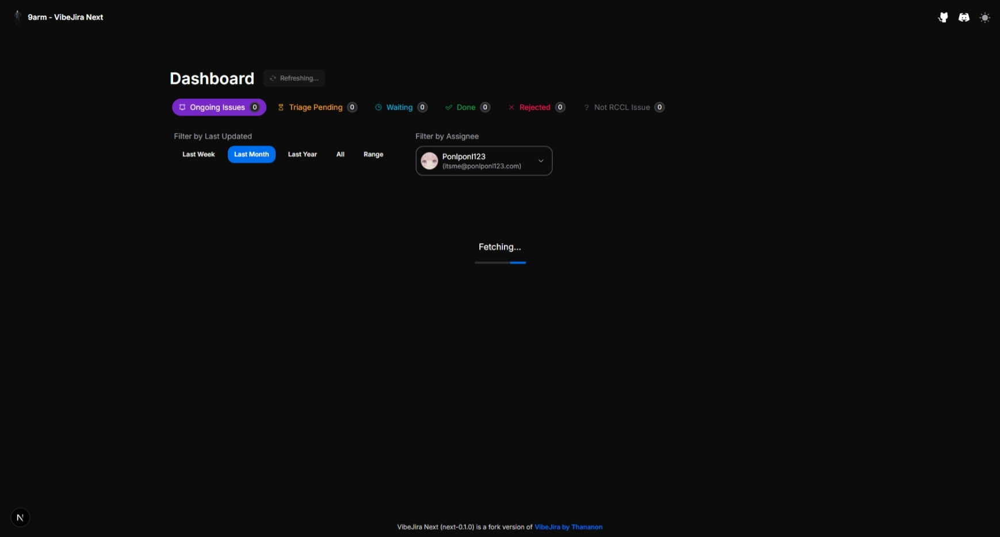
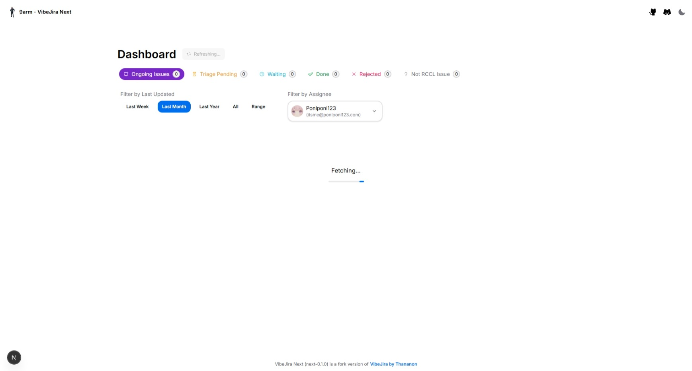

# VibeJira Next

> Note: **Disclamer** VibeJira Next is fork version of [VibeJira by Thananon](https://github.com/thananon/vibejira).

A web application to display and interact with JIRA tickets.

## Prerequisites

*   Node.js (v16 or later recommended)
*   npm (usually comes with Node.js) or bun (v1.2.5 or later)
*   A JIRA Cloud instance
*   A JIRA Personal Access Token (PAT) - See [Atlassian Documentation](https://support.atlassian.com/atlassian-account/docs/manage-api-tokens-for-your-atlassian-account/) on how to create one. You'll need permissions to read/write JIRA issues.

## Screenshot

- Dark theme
    
- Light theme
    

## Installation

- **with node package manager**
    ```bash
    npm install
    ```
- **with bun**
    ```bash
    bun install
   ```

## Usage

- **For Development**

    just run the dev script provided in package.json:
    ```bash
    npm run dev
    ```
    or using bun
    ```bash
    bun run dev
    ```
    ```bash
    bun dev
    ```

- **For Production**

    Nextjs Output config has set output to standalone for Dockerimage, so you can run this via Docker or Kubernetes or ever you want.

    If you want to run this on your computer via Terminal or something else, you need to manually copy `public` directory and `.next/static` then put it into `.next/standalone` directory.

    Then run the production server with this command
    ```bash
    node ./next/standalone/server.js
    ```
    or using bun
    ```bash
    bun ./next/standalone/server.js
    ```

## Roadmap

- [ ] Refactor Code base
- [ ] Dockerimage support